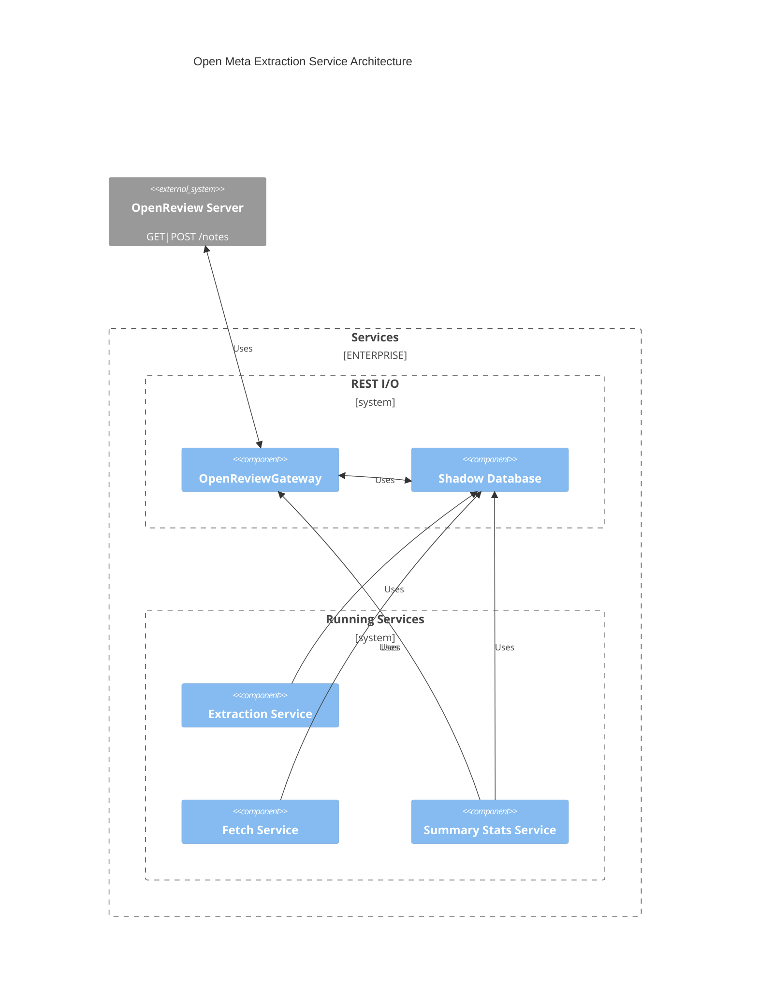

# Title

```mermaid
C4Context
  title Open Meta Extraction Service Architecture

  System_Ext(OpenReviewAPI, "OpenReview Server", "GET|POST /notes")

  Enterprise_Boundary(all, "Services") {
    Boundary(b0, "REST I/O") {
      Component(gateway, "OpenReviewGateway")
      BiRel(gateway, OpenReviewAPI, "Uses")

      Component(shadowDB, "Shadow Database")
      BiRel(shadowDB, gateway, "Uses")
    }

    Boundary(b1, "Running Services") {
      Component(extractSvc, "Extraction Service")
      Rel(extractSvc, shadowDB, "Uses")

      Component(fetchSvc, "Fetch Service")
      Rel(fetchSvc, shadowDB, "Uses")

      Component(statusSvc, "Summary Stats Service")
      Rel(statusSvc, shadowDB, "Uses")
      Rel(statusSvc, gateway, "Uses")
    }


  }

  UpdateLayoutConfig($c4ShapeInRow="3", $c4BoundaryInRow="1")

```
